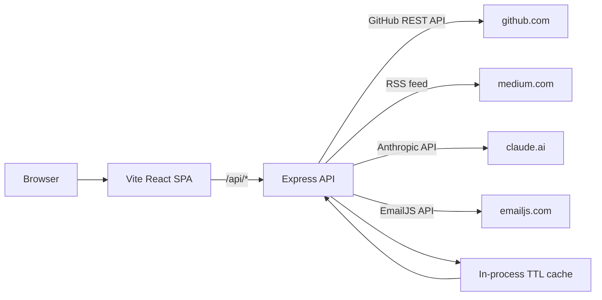

# Architecture

## Overview

dragon-portfolio is a full-stack portfolio site using a Vite + React frontend and a Node/Express API backend. The frontend is deployed as a static GitHub Pages site; the backend is deployed separately as a Node service.

## Component Map

```
dragon-portfolio/
├── src/              React + Vite frontend (SPA)
│   ├── components/   Reusable UI components (hero, cards, nav, chat, contact)
│   ├── pages/        Route-level page components
│   ├── hooks/        Custom React hooks (scroll, theme, data fetching)
│   ├── utils/        Utility modules (API client, chat runtime, theme)
│   ├── data/         Static curated data (case studies, project list)
│   └── config/       App-level constants and environment config
├── server/           Node/Express API backend
│   ├── index.js      Entry point — routes, middleware, rate limiting
│   ├── cache.js      In-process TTL cache for external API responses
│   └── data/         Server-side static data (LinkedIn context)
├── public/           Static assets served by Vite
└── asset/            Design assets (fonts, icons, palette references)
```

## Data Flow



## Key Design Decisions

1. **Static frontend + separate API**: The Vite build is fully static and can be served from GitHub Pages. Authenticated third-party calls (GitHub token, Anthropic key) are proxied through the Node backend, keeping secrets server-side.
2. **In-process TTL cache**: GitHub and Medium responses are cached for 5–10 minutes to avoid rate-limit exhaustion on the free GitHub API tier.
3. **CORS allowlist**: Production deployments must set `CORS_ORIGINS` to the exact GitHub Pages origin. The `*` wildcard is only acceptable in local development.
4. **React Three Fiber 3D hero**: Three.js rendering is isolated to the hero section and lazy-loaded to avoid blocking the initial paint.
5. **Visitor mode system**: The chat system prompt adapts based on a visitor mode hint (hiring, learning, exploring) to improve response relevance without compromising the fixed server-side system role.

## Deployment Model

```
GitHub Pages         GitHub Actions
(static frontend) ◄── pages.yml workflow ◄── main branch push

Render / Railway     (manual or CI-triggered)
(Node API backend) ◄── server/index.js + env vars
```

See `README.md` for environment variable reference and deployment steps.
