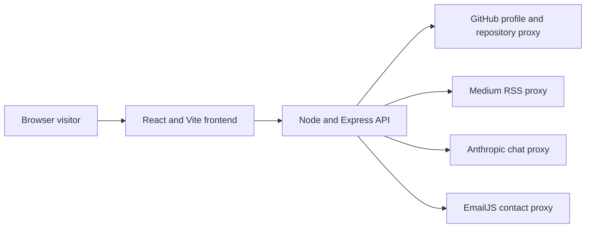

<!-- Generated by GitHub Copilot -->
# dragon-portfolio

Production-ready React + Node portfolio for Ram Prakash Dhulipudi with cinematic UI, live profile integrations, and secure API proxies.

## Included in this build

- 3D hero scene using React Three Fiber
- Scroll-reveal interactions across sections
- Live GitHub profile and repositories feed
- Live Medium RSS article feed
- Curated LinkedIn context rendered into About and profile sections
- Chatbot and contact flow via backend proxies
- API service with validation, rate limiting, CORS, and request tracing
- Top 3 featured portfolio case studies with STAR conversion narrative
- Measurable impact cards with quantified delivery outcomes
- Release radar and maturity tags for flagship repository tracking

## Architecture Snapshot



## Quick Start

```bash
npm install
npm run dev
```

Open:

1. Frontend: http://127.0.0.1:5173
2. Backend API health: http://127.0.0.1:8080/api/health

## Run locally

```bash
npm install
npm run dev
```

Frontend only mode:

```bash
npm run dev:client
```

Backend only mode:

```bash
npm run dev:server
```

## Environment variables

Copy values into a local .env file:

- `VITE_API_BASE_URL` (default: `/api`)
- `PORT` (default: `8080`)
- `CORS_ORIGINS` (comma-separated allowlist)
- `CHAT_RATE_LIMIT_PER_MINUTE`
- `ANTHROPIC_API_KEY`
- `ANTHROPIC_MODEL`
- `ANTHROPIC_FAST_MODEL`
- `CHAT_MAX_TOKENS`
- `CHAT_HISTORY_CHAR_BUDGET`
- `CHAT_FAST_MODEL_CHAR_THRESHOLD`
- `EMAILJS_PUBLIC_KEY`
- `EMAILJS_SERVICE_ID`
- `EMAILJS_TEMPLATE_ID`
- `GITHUB_USERNAME`
- `GITHUB_TOKEN` (optional but recommended)
- `MEDIUM_USERNAME`
- `MEDIUM_TOTAL_ARTICLES` (fallback used when Medium feed is unavailable)

See [.env.example](.env.example) for defaults.

## Deploy to GitHub Pages (Project Page)

This repository is configured for project-page deployment at:

- `https://<github-username>.github.io/dragon-portfolio/`

The frontend is static, but profile/chat/contact features require the Node API to be hosted separately.

### 1. Deploy the backend API

Deploy `server/index.js` to a Node host (for example Render, Railway, or Fly.io) and configure production environment variables:

- `PORT`
- `CORS_ORIGINS`
- `ANTHROPIC_API_KEY`
- `ANTHROPIC_MODEL`
- `ANTHROPIC_FAST_MODEL`
- `CHAT_MAX_TOKENS`
- `CHAT_HISTORY_CHAR_BUDGET`
- `CHAT_FAST_MODEL_CHAR_THRESHOLD`
- `EMAILJS_PUBLIC_KEY`
- `EMAILJS_SERVICE_ID`
- `EMAILJS_TEMPLATE_ID`
- `GITHUB_USERNAME`
- `GITHUB_TOKEN` (optional)
- `MEDIUM_USERNAME`
- `MEDIUM_TOTAL_ARTICLES`

Set `CORS_ORIGINS` to include your GitHub Pages origin, for example:

- `https://<github-username>.github.io`

### 2. Configure repository variables

In GitHub repository settings, add Actions variable:

- `VITE_API_BASE_URL` = `https://<your-backend-domain>/api`

Optional override:

- `VITE_BASE_PATH` (defaults to `/dragon-portfolio/`)

### 3. Enable GitHub Pages deployment source

In repository Settings -> Pages:

- Source: `GitHub Actions`

### 4. Publish updates

Push changes to `main`. Workflow `.github/workflows/pages.yml` will:

- install dependencies
- run lint, tests, and API syntax checks
- build the frontend
- deploy `dist` to GitHub Pages

### 5. Verify live deployment

After deployment completes, validate:

- app loads at `https://<github-username>.github.io/dragon-portfolio/`
- no JavaScript or CSS asset 404 errors
- profile data loads from backend
- chat responses work
- contact submission works

## Validation commands

```bash
npm run lint
npm run test
npm run build
```

## Testing

1. Run unit tests: `npm run test`.
2. Run lint gate: `npm run lint`.
3. Run production build check: `npm run build`.

## Week 7 Conversion Quality Highlights

1. Added dedicated case-study treatment for the top three flagship projects.
2. Added measurable impact cards to surface quantifiable outcomes in recruiter-friendly form.
3. Added release radar with maturity tags to communicate delivery cadence and next release intent.
4. Updated projects section narrative so the portfolio reads as a credible project index, not only a visual experience.

Release target for this sprint: `v0.2.0`.

## Week 9 Open Source Visibility Notes

1. External contribution target increased to 3 PRs for the sprint week.
2. Meaningful issue-comment target increased to 5 technical comments.
3. Contribution evidence links are tracked from profile README notes to keep public activity auditable.

## Contributor Credits

1. @Ramdragneel01 - sprint planning, implementation, quality validation, and release publication.

## Week 10 Quality-Gate Automation

1. CI now includes coverage and runtime dependency-audit gates.
2. Release workflow is aligned to semantic tags (`v*.*.*`) with release artifact publishing.
3. Dependabot configuration is enabled for weekly npm dependency updates.
4. Dependency review and rollout rules are defined in `DEPENDENCY_POLICY.md`.

Release target for this sprint: `v0.3.0`.

## API endpoints

- GET `/api/health`
- GET `/api/profile`
- POST `/api/chat`
- POST `/api/contact`

## Security baseline

- Anthropic and EmailJS credentials are server-side only.
- Frontend communicates through backend endpoints only.
- Backend applies input validation and rate limiting.

## Limitations

1. Public frontend deployment depends on a separately hosted backend for live profile, chat, and contact capabilities.
2. Large 3D scene payloads can increase initial bundle size on low-bandwidth clients.
3. External feed and API availability can affect live content freshness.

## Roadmap

1. Add dynamic code-splitting for heavy scene and visualization modules to reduce first-load cost.
2. Add cached API response strategy with expiration telemetry for profile and feed endpoints.
3. Add end-to-end Playwright flows for contact and chat critical paths.
